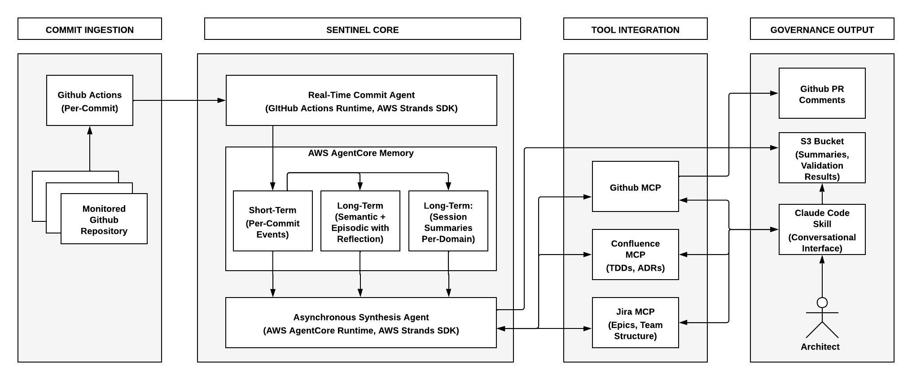

# Sentinel: Autonomous Architectural Governance Through Commit Intelligence Across Multi-Repository Systems

**ACM CAIS 2026 — Demo Track Submission**

Roberto Milev, Uday Kanagala — Navan

---

## Overview

Large-scale software organizations document architectural decisions in technical design documents (TDDs) and architecture decision records (ADRs), but lack automated mechanisms to verify that implementation actually conforms to these specifications. Sentinel bridges this gap.

Sentinel is a system of choreographed asynchronous agents that provides continuous architectural governance across an organization's repositories. A real-time commit agent processes every push via GitHub Actions, writing structured events to Amazon Bedrock AgentCore's two-tier memory model. A separate synthesis agent periodically reads from long-term memory — semantic, episodic, and session summaries — to group commits into development initiatives and validate them against documented architectural decisions.

### Architecture



### How It Works

1. **Per-commit analysis** — A lightweight agent triggered on every push analyzes the diff and writes structured context (author, repo, functional summary, affected components) to AgentCore short-term memory. Long-term strategies auto-extract facts and patterns in the background.

2. **Initiative synthesis** — An async agent (runs 2-3x/week) queries all three long-term memory strategies to group related commits into development initiatives spanning repos and teams, then matches them against Jira epics and Confluence TDDs.

3. **Architectural validation** — The synthesis agent evaluates whether each initiative is being built in conformance with its corresponding TDD and ADRs. When drift is detected, Sentinel flags the violation as a PR comment before merge.

## Resources

| Resource | Link |
|----------|------|
| Demo Video (YouTube) | [https://youtu.be/-XISve8X3so](https://youtu.be/-XISve8X3so) |
| Demo Video (raw) | [video/sentinel-demo-final.mp4](video/sentinel-demo-final.mp4) |
| Demo Data (S3) | [sentinal-features-summary](https://sentinal-features-summary.s3.us-west-1.amazonaws.com) |
| Conference | [ACM CAIS 2026](https://www.caisconf.org/) |

## Repository Structure

```
├── README.md
├── skill/                           # Sentinel Claude Code skill (full source)
│   ├── SKILL.md                     # Skill definition — 9 workflows, trigger patterns
│   ├── scripts/
│   │   ├── aggregate_feature_development.sh   # Fetches & aggregates PR summaries from S3
│   │   ├── fetch_design_docs.sh               # Syncs TDD index from Confluence via Bedrock
│   │   ├── fetch_design_requirements.sh       # Downloads TDD policy document
│   │   └── fetch_feature_development_history.sh  # Multi-week history for a single service
│   └── references/
│       ├── DESIGN_COVERAGE_ANALYSIS.md        # Coverage analysis methodology
│       ├── governance/
│       │   ├── dev-rules/
│       │   │   ├── CONSOLIDATED_ARCHITECTURE_AND_DEV_RULES.md  # Unified standards doc
│       │   │   ├── langchain-python-CLAUDE.md     # Python monorepo standards
│       │   │   ├── langchainjs-AGENTS.md          # TypeScript ESLint rules & patterns
│       │   │   └── langgraph-CLAUDE.md            # LangGraph monorepo standards
│       │   ├── contributing/
│       │   │   ├── contributing-overview-python.md
│       │   │   ├── contributing-code-python.md
│       │   │   ├── contributing-documentation.md
│       │   │   ├── contributing-integrations-python.md
│       │   │   ├── langchainjs-CONTRIBUTING.md
│       │   │   └── langchainjs-INTEGRATIONS.md
│       │   ├── versioning/
│       │   │   └── versioning-policy.md           # Semantic versioning & API stability tiers
│       │   └── adrs/
│       │       └── ADR-014-schema-agnostic-validation-for-llm-providers.md
│       └── feature-development-summaries/
│           └── feature_development_summary_2026-03-09.md  # Sample output
├── figures/                         # Architecture diagram
│   └── sentinel-arch.png
├── video/                           # Demo video (raw binary for archival)
│   └── sentinel-demo-final.mp4
└── data/                            # Public S3 bucket — demo dataset
    └── https://sentinal-features-summary.s3.us-west-1.amazonaws.com/2026-03-09/
```

## Sentinel Skill

The [`skill/`](skill/) directory contains the full source of the Claude Code skill that serves as the conversational interface for architects. This is the same skill demonstrated in the video — an architect loads it in Claude Code and queries development activity in natural language. See [`skill/SKILL.md`](skill/SKILL.md) for the complete skill definition including all 9 workflows and trigger patterns.

## Demo Dataset

The demo in the video runs against 6 open-source LangChain ecosystem repositories:

| Repository | Language | Purpose |
|-----------|----------|---------|
| `langchain` | Python | Core framework — LLM abstractions, chains, agents, integrations |
| `langchainjs` | TypeScript | JavaScript/TypeScript port with full feature parity |
| `langgraph` | Python | Stateful multi-actor agent orchestration |
| `langgraphjs` | TypeScript | JS port of LangGraph |
| `deepagents` | Python | AI coding agent built on LangGraph |
| `deepagentsjs` | TypeScript | JS port of Deep Agents |

From ~100 PRs over 30 days, Sentinel discovers ~80 development initiatives. The primary demo initiative — **Standard Schema Support** (13+ PRs across 15+ provider packages by `@colifran`) — is evaluated against ADR-014.

The processed demo data (initiative summaries, feature development reports) is available in a public S3 bucket:

| Repository | Feature Summary |
|-----------|----------------|
| `langchain` | [langchain.txt](https://sentinal-features-summary.s3.us-west-1.amazonaws.com/2026-03-09/langchain.txt) |
| `langchainjs` | [langchainjs.txt](https://sentinal-features-summary.s3.us-west-1.amazonaws.com/2026-03-09/langchainjs.txt) |
| `langgraph` | [langgraph.txt](https://sentinal-features-summary.s3.us-west-1.amazonaws.com/2026-03-09/langgraph.txt) |
| `langgraphjs` | [langgraphjs.txt](https://sentinal-features-summary.s3.us-west-1.amazonaws.com/2026-03-09/langgraphjs.txt) |
| `deepagents` | [deepagents.txt](https://sentinal-features-summary.s3.us-west-1.amazonaws.com/2026-03-09/deepagents.txt) |
| `deepagentsjs` | [deepagentsjs.txt](https://sentinal-features-summary.s3.us-west-1.amazonaws.com/2026-03-09/deepagentsjs.txt) |

## Technology Stack

- **Agent Framework:** [AWS Strands](https://github.com/strands-agents/sdk-python)
- **Memory:** Amazon Bedrock AgentCore (two-tier: short-term events + long-term semantic/episodic/session strategies)
- **Tool Integration:** MCP tool servers for GitHub, Confluence, and Jira
- **Conversational Interface:** Claude Code skill
- **Storage:** Amazon S3 (initiative summaries and validation results)
- **Trigger:** GitHub Actions (per-commit webhook)

